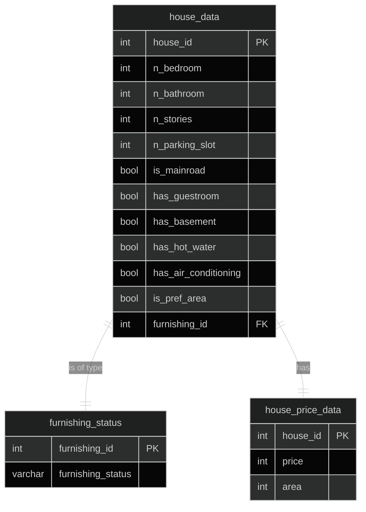

```mermaid
%%{
  init: {
    'theme': 'dark'
  }
}%%
erDiagram
  house_data {
    int house_id PK
    int n_bedroom
    int n_bathroom
    int n_stories
    int n_parking_slot
    bool is_mainroad
    bool has_guestroom
    bool has_basement
    bool has_hot_water
    bool has_air_conditioning
    bool is_pref_area
    int furnishing_id FK
  }
  house_price_data {
    int house_id PK
    int price
    int area
  }
  furnishing_status {
    int furnishing_id PK
    varchar furnishing_status
  }
  house_data ||--|| furnishing_status : "is of type"
  house_data ||--|| house_price_data : "has"
```